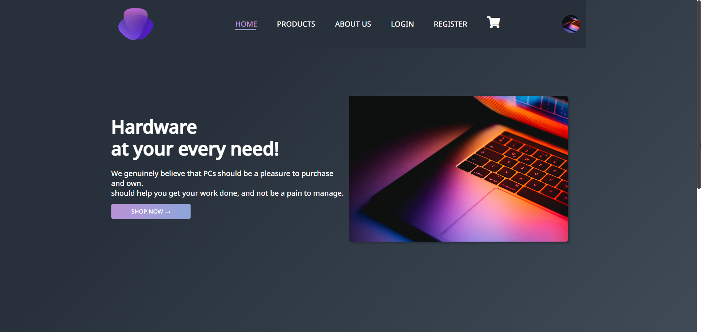
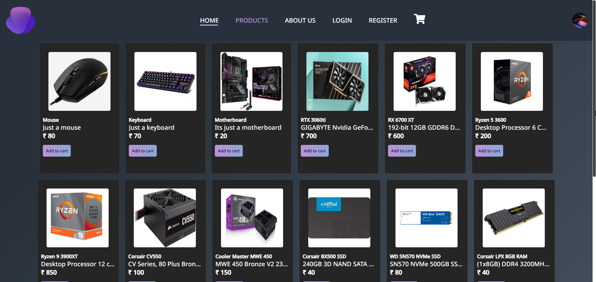
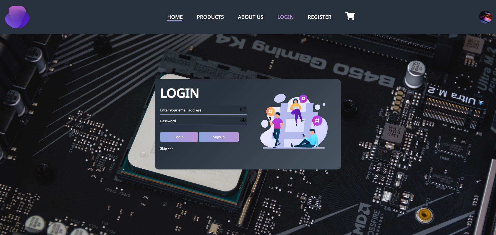
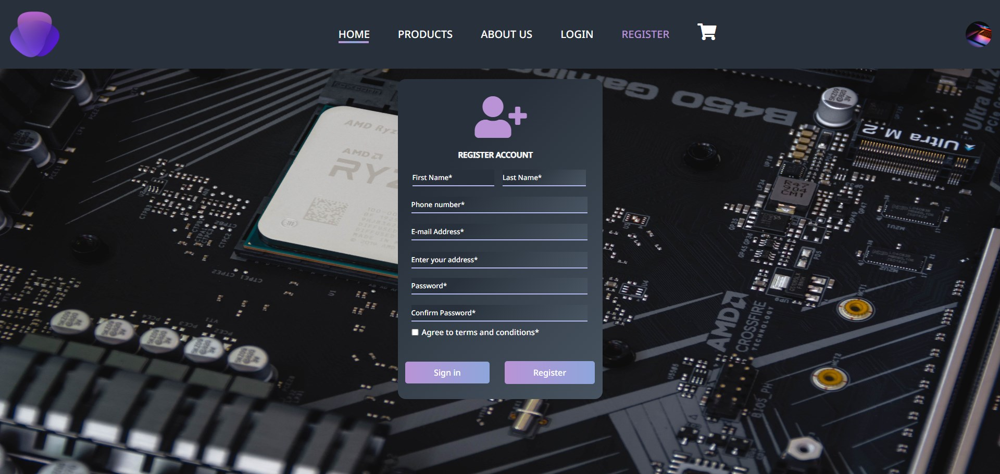
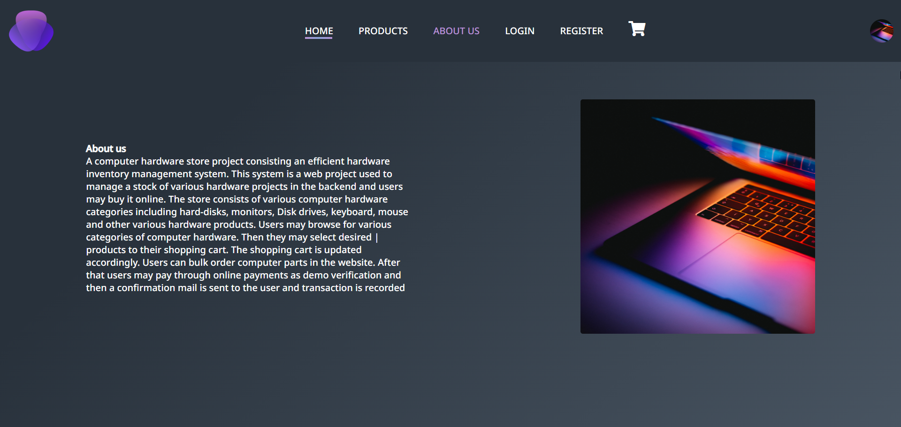

# N2R-Technologies
====================================
## Ecommerce Website 
### This website allows users to purchase computer accessories and parts 

## Images







Instructions to run the website on your local machine 

## Docker Installation

- Clone the repo 

- Navigate to the folder 

- Run the following command 


```
docker-compose up --build
```
- Now the project can be opened successfully in your prefered browser 

- By default the port is 80

```
https://localhost:80
```
- If their some database error try to login into myphpadmin once and refresh the website

- Default port for MyphpAdmin is 8081

```
https://localhost:8081
```

By default some place holder values are inserted can be disabled by changing the value to 0 (disable) or 1(enable)

```
$insert_values = 1;
```

The project is under development ⚠️
There may be some bugs 🪲

As long as you do not claim this project as yours its fine to use our work
